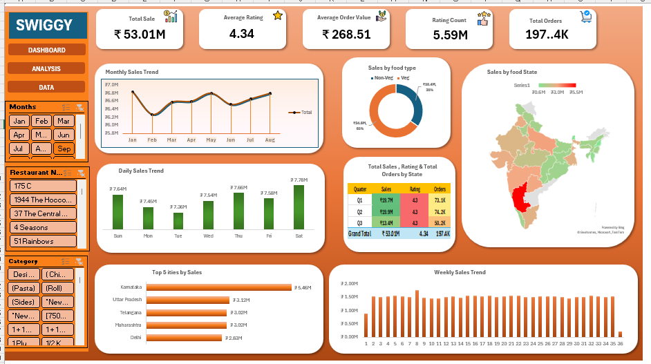

# 🍔 Swiggy Sales Analysis Dashboard (Microsoft Excel)



## 📌 Project Overview

This project is an interactive **Microsoft Excel Dashboard** developed using a real-world Swiggy sales dataset. The dashboard provides insights into sales performance, customer ratings, ordering patterns, and regional trends through interactive visualizations and KPI tracking.

The project demonstrates the complete data analysis workflow—from raw data preparation to dashboard creation—using Microsoft Excel.

---

## 🎯 Business Problem

Food delivery platforms generate large amounts of transactional data every day. This project aims to transform that data into meaningful business insights by answering questions such as:

- How do sales change over time?
- Which states and cities generate the highest revenue?
- What is the contribution of Veg vs Non-Veg food orders?
- How does business performance vary across quarters?
- What are the key performance indicators of the business?

---

## 📊 Key Performance Indicators (KPIs)

- 💰 Total Sales
- ⭐ Average Rating
- 🛒 Average Order Value
- 📝 Ratings Count
- 📦 Total Orders

---

## 📈 Dashboard Features

- 📅 Monthly Sales Trend
- 📊 Daily Sales Trend
- 📈 Weekly Sales Trend
- 🗓 Quarterly Performance Summary
- 🥗 Veg vs Non-Veg Sales Analysis
- 🗺 State-wise Sales Analysis
- 🏙 Top 5 Cities by Sales
- 🎛 Interactive Slicers & Filters

---

## 🛠 Data Preparation

The dataset was cleaned and enhanced before creating the dashboard.

### Data Cleaning
- Removed inconsistencies and unnecessary values
- Organized the dataset for analysis
- Created Pivot Tables for reporting

### Feature Engineering
- Added **Week** column for weekly trend analysis
- Added **Quarter** column for quarterly performance analysis
- Added **Veg / Non-Veg** column for food category comparison

---

## 🧰 Tools & Skills Used

- Microsoft Excel
- Pivot Tables
- Pivot Charts
- Slicers
- Map Charts
- Conditional Formatting
- Data Cleaning
- Feature Engineering
- Dashboard Design
- Business Analysis

---

## 📷 Dashboard Preview

The interactive dashboard provides a consolidated view of Swiggy sales performance.


---

## 💡 Business Insights

- Analyzed monthly, weekly, and daily sales performance.
- Compared sales between Veg and Non-Veg food categories.
- Identified the top-performing cities based on revenue.
- Visualized state-wise sales using a map chart.
- Evaluated quarterly business performance.
- Monitored customer satisfaction using average ratings.
- Measured Average Order Value and Total Orders through KPI cards.

---

## 📂 Repository Structure

```
Swiggy-Sales-Excel-Dashboard
│
├── README.md
├── dataset
│   ├── Swiggy_Raw_Data.xlsx
│   └── Swiggy_Refined_Data.xlsx
│
└── assets
    └── dashboard.png
```

---

## 🚀 Skills Demonstrated

- Data Cleaning
- Data Transformation
- Feature Engineering
- Excel Dashboard Development
- Data Visualization
- Business Intelligence
- KPI Reporting
- Analytical Thinking

---

## 📁 Files Included

| File | Description |
|------|-------------|
| **Swiggy_Raw_Data.xlsx** | Original dataset |
| **Swiggy_Refined_Data.xlsx** | Cleaned dataset with additional Week, Quarter, and Veg/Non-Veg columns |
| **dashboard.png** | Dashboard preview image |
| **README.md** | Project documentation |

---

## 📬 Connect With Me

**Saurabh Singh**

- **GitHub:** https://github.com/saurabhsingh-20
- **LinkedIn:** https://www.linkedin.com/in/saurabh-singh-03181b262/

---

⭐ **If you found this project useful, consider giving it a Star!**
